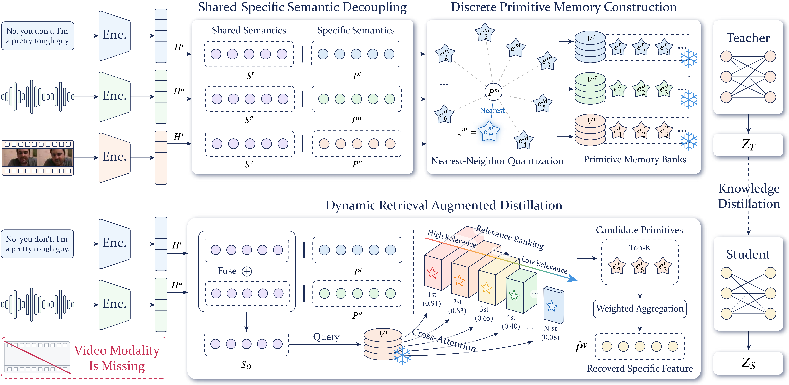

<h1 align="center">[PriMD] Modality Disentangled Learning for Incomplete Multimodal Emotion Recognition: A Primitive Memory Distillation Perspective</h1>

<p align="center">
  <b>Jiaqi Zhang</b>, Zheng Pang, Mengting Li, Yiqi Wang, Guangyuan Dong, Chao Xue, Yusen Wu, Zihao Li, Huy Phan, Sicheng Zhao, Björn Schuller, Jiachen Luo
</p>

<div align="center">
  <a href="https://arxiv.org/abs/2608.30563"></a>
  &nbsp;&nbsp;
  <a href="https://jiaqizhang-sengoku.github.io/PriMD/"></a>
</div>

## 📌 Abstract

Multimodal Emotion Recognition (MER) often suffers from missing modalities in real-world scenarios. Existing methods usually generate, align, or distill missing modalities as a whole, overlooking the heterogeneity of information components within each modality. Such holistic treatment mixes inferable shared semantics with uncertain modality-specific details, causing unstable representations and weakening robustness. To address this issue, we propose the Primitive Memory Distillation (PriMD) framework. Unlike existing methods, PriMD takes an intra-modal perspective and focuses on the differences among information components within each modality. PriMD first disentangles cross-modal shared semantics from modality-specific representations, and then discretizes the latter into learnable semantic prototypes to construct modality-specific memory banks. When modalities are missing, the student uses the shared semantics of visible modalities as queries to dynamically retrieve prototypes. It compensates for missing modality-specific information within a constrained memory space and aligns with the teacher. Extensive experiments on IEMOCAP, CMU-MOSI, and CMU-MOSEI demonstrate that PriMD achieves state-of-the-art robustness across a wide range of missing-modality settings, while mitigating the instability caused by holistic feature inference.

## 🎇 Method Overview

<p align="center">
  
</p>

## 💡 Key Features

- We propose PriMD, a framework that starts from the internal information structure of modalities and formulates incomplete MER as a unified process of shared semantic estimation and constrained compensation of modality-specific information.
- PriMD includes SSSD for separating shared and specific features, as well as DPMC and DRAD for discretizing the feature space and addressing missing-modality compensation.
- Extensive experiments show that PriMD mitigates the instability caused by holistic representation and outperforms existing methods under various modality-missing scenarios.

## 🚀 Installation & Usage

### 1. Environment

```bash
cd PriMD

# Optional: activate your own environment first.
# conda activate <your-env>

pip install -r requirements.txt
```

### 2. Dataset Layout

PriMD uses pre-extracted utterance-level multimodal features:

```text
dataset/
|-- IEMOCAP/
|-- CMUMOSI/
`-- CMUMOSEI/
```

Default feature configuration:

| Modality | Feature Name |
| --- | --- |
| Acoustic | `wav2vec-large-c-UTT` |
| Textual | `deberta-large-4-UTT` |
| Visual | `manet_UTT` |

### 3. Quick Start

Run the IEMOCAP four-class experiment:

```bash
sh run_PriMD_iemocap4.sh
```

Run CMU-MOSI or CMU-MOSEI:

```bash
sh run_PriMD_cmumosi.sh
sh run_PriMD_cmumosei.sh
```

Run a single missing-modality condition manually:

```bash
python -u PriMD/train_PriMD.py \
  --dataset=IEMOCAPFour \
  --audio-feature=wav2vec-large-c-UTT \
  --text-feature=deberta-large-4-UTT \
  --video-feature=manet_UTT \
  --seed=66 \
  --batch-size=16 \
  --epoch=200 \
  --lr=0.0001 \
  --hidden=256 \
  --depth=4 \
  --num_heads=2 \
  --drop_rate=0.5 \
  --attn_drop_rate=0.0 \
  --test_condition=a \
  --stage_epoch=100 \
  --gpu=0
```

### Training Outputs

Training logs and checkpoints are saved under:

```text
saved/
|-- log/main_result/
`-- model/main_result/
```


## 📝 References

If you find the code useful for your research, please consider citing:

```bib

```

## 📢 LICENSE

The project is under [MIT License](./LICENSE), and is for research purpose ONLY.


